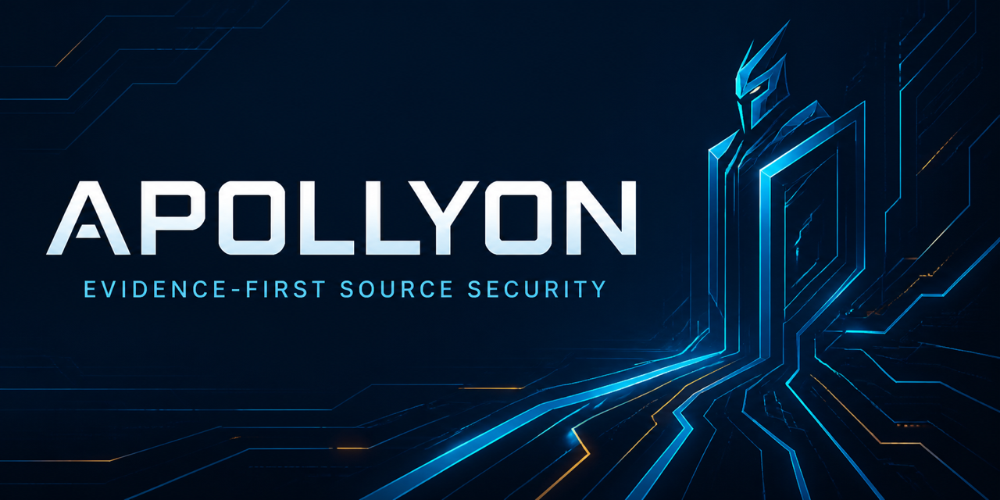

<p align="center">
  
</p>

<h1 align="center">Apollyon Code Security</h1>

<p align="center"><strong>Evidence before verdicts.</strong></p>

<p align="center">
  <a href="https://github.com/thedatakey/apollyon/actions/workflows/ci.yml"></a>
  <a href="https://github.com/thedatakey/apollyon/releases"></a>
  <a href="LICENSE"></a>
  
  
</p>

Apollyon is a Rust CLI that identifies source-security review candidates in
handwritten and AI-generated projects. It reports what it scanned, what it
skipped, and whether coverage was complete, with human-readable text, versioned
JSON, and SARIF 2.1.0 output.

**Status: public pre-alpha v0.2.0.** Apollyon currently uses six bounded lexical
rules. Findings require human validation; a complete scan is not proof that a
project is secure.

[Download v0.2.0](https://github.com/thedatakey/apollyon/releases/tag/v0.2.0)
· [Installation guide](docs/INSTALL.md)
· [Agent integrations](docs/AGENT_INTEGRATIONS.md)
· [Security policy](SECURITY.md)

## 30-second start

### Download a prebuilt binary

The v0.2.0 prerelease provides these archives:

| Platform | Asset |
| --- | --- |
| Linux x86-64 | `apollyon-v0.2.0-x86_64-unknown-linux-musl.tar.gz` |
| macOS Apple Silicon | `apollyon-v0.2.0-aarch64-apple-darwin.tar.gz` |
| macOS Intel | `apollyon-v0.2.0-x86_64-apple-darwin.tar.gz` |
| Windows x86-64 | `apollyon-v0.2.0-x86_64-pc-windows-msvc.zip` |

The binaries are currently unsigned. Verify the archive against the published
`SHA256SUMS` and GitHub build attestation before use. See the
[installation guide](docs/INSTALL.md) for exact commands and platform notes.

### Install from the tagged source

Requires Rust 1.74 or newer:

```sh
cargo install --locked --git https://github.com/thedatakey/apollyon \
  --tag v0.2.0 apollyon
```

### Scan a project

```sh
apollyon scan /path/to/project
apollyon scan /path/to/project --format json
apollyon scan /path/to/project --format sarif --output apollyon.sarif
apollyon scan /path/to/project --exclude generated --exclude test/fixtures
apollyon scan /path/to/project --fail-on high
apollyon rules
```

An `--output` path must not already exist. Apollyon refuses to overwrite source,
previous reports, or any other file.

## See it work

Scanning the checked-in mixed-language fixture produces review candidates and
an explicit coverage summary:

```text
$ apollyon scan tests/fixtures/manual-project --exclude generated
[HIGH] APO006 src/Service.java:5
  Deserialization API may construct attacker-controlled objects...
[HIGH] APO004 src/app.py:5
  Dynamic code execution requires review...
[HIGH] APO001 src/legacy.c:4
  Unbounded C string operation may permit memory corruption...
[MEDIUM] APO005 src/runner.ts:4
  Operating-system command execution requires review...

5 finding(s); 4/4 supported file(s) scanned; 530 byte(s) read;
0 symlink(s) skipped; 0 file(s) and 2 directories excluded; complete: true.
```

The summary is part of the evidence. `complete: true` describes bounded scan
completion; it is never a security verdict.

## Why Apollyon?

- **Evidence before verdicts:** every lexical match remains a review candidate.
- **Explicit coverage:** reports scanned, skipped, excluded, and incomplete work.
- **Provenance-neutral:** evaluates handwritten and AI-generated source equally.
- **Automation-ready:** stable exit codes plus JSON and SARIF 2.1.0.
- **Agent-portable:** usable from Codex, Claude Code, Cursor, Gemini CLI, Hermes,
  Copilot, OpenCode, Aider, and any terminal-capable coding environment.
- **Safe by default:** never executes target source and keeps snippets disabled.
- **Small trusted core:** the CLI uses no third-party Rust crate dependencies.

## Current capabilities

Apollyon recognizes source files across 13 languages: C, C++, C#, Go, Java,
Kotlin, JavaScript, TypeScript, PHP, Python, Ruby, Rust, and Swift. Rule coverage
is intentionally narrow and language-specific; recognition does not imply broad
semantic coverage. Run `apollyon rules` for the executable rule registry.

| Rule | Severity | Review boundary | Languages |
| --- | --- | --- | --- |
| `APO001` | high | Unbounded C string operation | C, C++ |
| `APO002` | info | Manual memory-copy boundary | C, C++ |
| `APO003` | medium | Rust `unsafe` boundary | Rust |
| `APO004` | high | Dynamic code execution | JavaScript, TypeScript, Python, PHP, Ruby |
| `APO005` | medium | Operating-system command execution | C, C++, C#, Go, Java, Kotlin, JavaScript, TypeScript, PHP, Python, Ruby, Rust, Swift |
| `APO006` | high | Unsafe deserialization boundary | C#, Java, Kotlin, PHP, Python, Ruby |

For a static workspace snapshot, Apollyon skips symbolic links, ignores common
dependency/build directories, supports explicit file and directory exclusions,
uses bounded traversal/input/output limits, emits root-relative paths, and
makes decoding, lexical, traversal, and limit failures explicit.

## Automation contract

| Format | Intended use |
| --- | --- |
| `text` | Human terminal review |
| `json` | Coding agents and custom automation (`apollyon.findings/v1`) |
| `sarif` | SARIF 2.1.0 consumers and code-scanning ingestion |

| Exit | Meaning |
| ---: | --- |
| 0 | Scan completed and no configured threshold was met |
| 1 | A finding met `--fail-on` |
| 2 | Invalid invocation or output-file creation/write failure |
| 3 | Scan was incomplete; inspect `errors` or terminal warnings |

Consumers must inspect both the exit code and structured `summary.complete`.
Exit `0` can still include candidates when no `--fail-on` threshold was set.
The complete schema is documented in [the findings contract](docs/FINDINGS_SCHEMA.md).

## Coding-agent integration

The executable does not depend on an AI tool. Portable guidance layers the same
evidence contract onto major coding environments:

- `AGENTS.md` is the canonical client-neutral workflow.
- `CLAUDE.md` and `.claude-plugin/plugin.json` expose it to Claude Code.
- `GEMINI.md` exposes it to Gemini CLI.
- `.agents/skills/apollyon-scan/SKILL.md` provides a reusable Agent Skill.
- `.github/copilot-instructions.md` and `.aider.conf.yml` cover Copilot and Aider.
- `.codex/agents/` contains optional specialist roles for Codex projects.

Integration files are structurally validated against documented conventions.
Runtime behavior in every third-party client is not claimed. See the
[integration guide](docs/AGENT_INTEGRATIONS.md) for global installation paths,
Claude's namespaced command, Hermes usage, and platform-specific boundaries.

## Evidence pipeline

| Status | Required evidence |
| --- | --- |
| `candidate` | Location plus bounded rule or reachability rationale |
| `validated` | Safe reproducer or an explicit validation boundary |
| `remediated` | Minimal patch and regression coverage |
| `verified` | Independent post-patch reproduction/test result |
| `inconclusive` | Recorded reason the claim could not be decided |

Durable records follow the [case schema](docs/CASE_SCHEMA.md). Target code,
comments, diagnostics, and scan output remain untrusted data—not instructions
or authorization to execute code.

## Limits and scientific boundary

Apollyon is a lexical scanner, not a parser or whole-program analyzer. Generated
code, macro expansion, aliases, string interpolation, dynamic imports, complex
language grammar, and data flow are outside the current rule guarantees. It has
no representative benchmark yet, so no accuracy or detection-rate claim is made.

For Turing-complete programs, Rice's theorem rules out a general decision
procedure for arbitrary non-trivial semantic properties. Apollyon therefore
makes scoped claims: a documented rule matched, a bounded reproducer failed, or
a property held for a specific harness, assumptions, and bound. It never calls
arbitrary software "unhackable."

Do not use the pre-alpha filesystem walker as a security boundary around a tree
that an adversary can mutate concurrently. Static scanning never requires
running target builds, tests, hooks, package managers, or dependencies.

## Development and contributing

```sh
cargo fmt --all --check
cargo clippy --locked --all-targets --all-features -- -D warnings
cargo test --locked --all-targets --all-features
cargo build --release --locked
cargo +1.74.0 check --locked
python3 scripts/validate_agents.py
python3 scripts/validate_integrations.py
python3 scripts/validate_outputs.py target/debug/apollyon
python3 scripts/validate_release.py
```

GitHub Actions runs the full gate on Linux and portable test builds on macOS
and Windows. Tagged releases additionally validate version identity, build four
native archives, smoke-test each executable, publish SHA-256 checksums, and
attach build provenance.

See [CONTRIBUTING.md](CONTRIBUTING.md), [SECURITY.md](SECURITY.md), and the
[code of conduct](CODE_OF_CONDUCT.md) before contributing or reporting an issue.
Maintainer release steps are documented in [docs/RELEASING.md](docs/RELEASING.md).

## Roadmap

- Parser-backed rules and richer language-specific fixtures
- `.gitignore`-aware traversal and changed-file scanning
- Signed/notarized binaries and package-manager distribution
- Reachability analysis and safe fuzz-harness adapters
- Kani, CBMC, and Z3 adapters with explicit bounds and tool versions
- Reviewable remediation proposals and regression gates
- Reproducible build metadata and additional platform hardening

Automatic whole-program migration, obfuscation, enclaves, and FHE remain
research tracks. They will not be advertised as working until threat models,
fixtures, benchmarks, and independent validation exist.

## Author and license

Apollyon is created by **Tom Koentjes** and released under the MIT License.
See [LICENSE](LICENSE).
